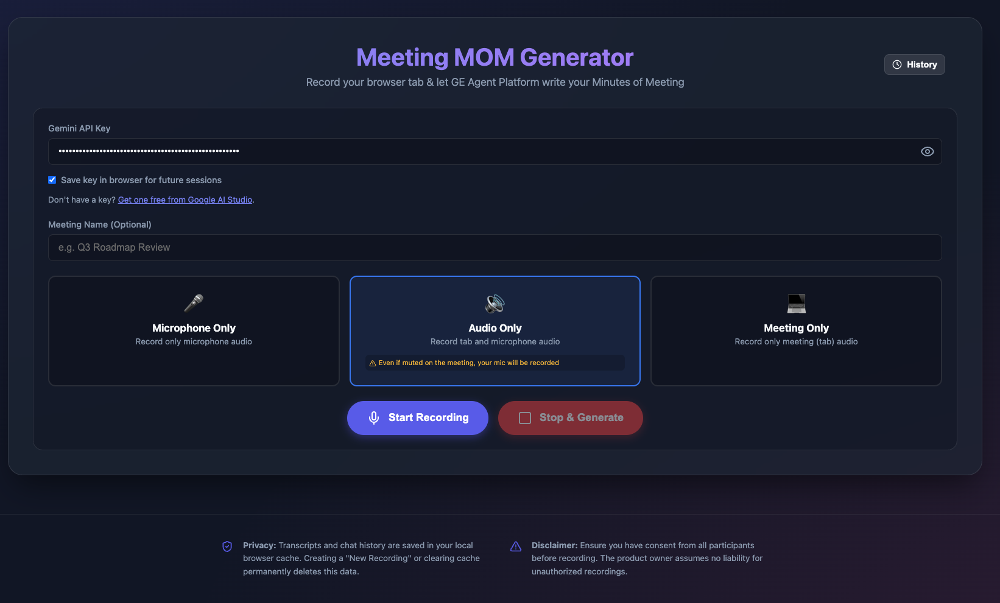
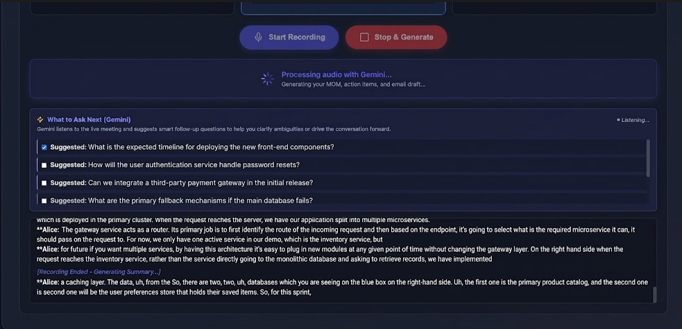
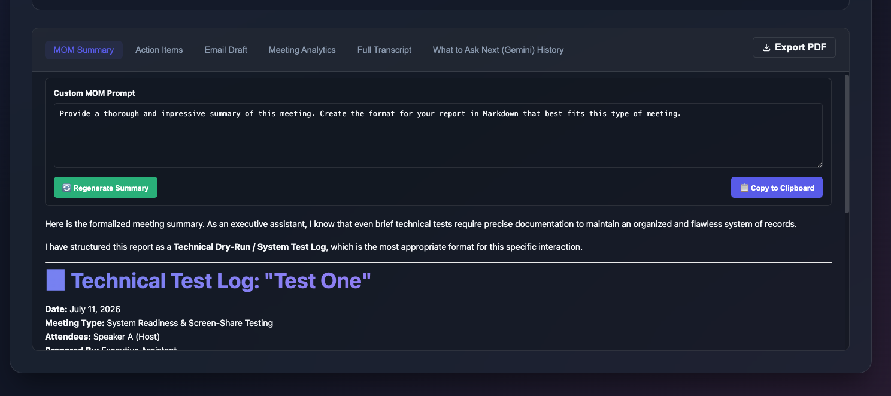
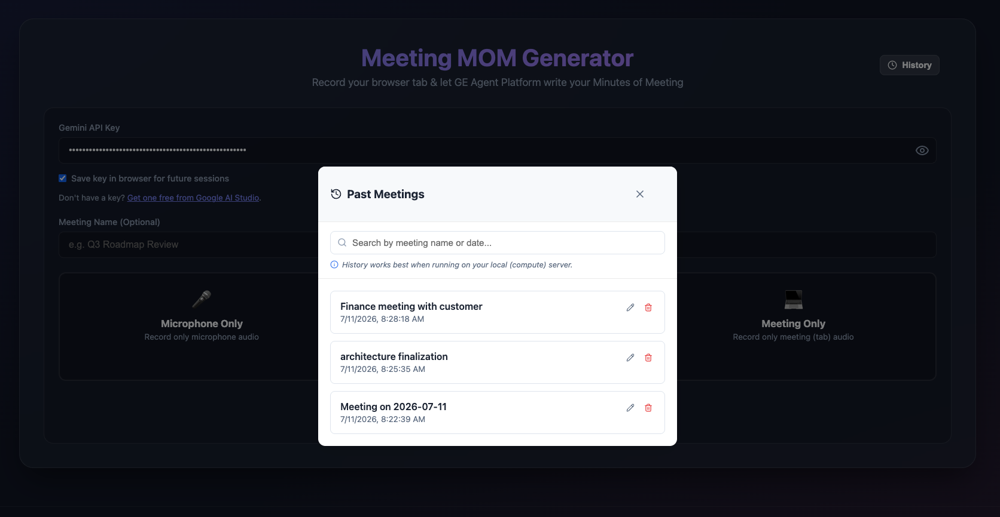

# AI Meeting MOM Generator



A powerful, serverless web application that records your live browser and microphone audio, generates real-time transcription, and uses Google's Gemini models to automatically write your Minutes of Meeting (MOM), Action Items, and Follow-Up Emails.

> **⚠️ Disclaimer:** The developer of this tool is not responsible for its usage. Please use this recording tool carefully, responsibly, and in accordance with your local laws and company policies regarding recording meetings.

## 📸 Screenshots

### Live Transcription & Insights


### MOM Output & Action Items


### Meeting History


## ✨ Features

*   **Live Audio Transcription:** Uses the Web Audio API to capture both system tab audio and microphone input, streaming it in 15-second chunks to the Gemini API for highly accurate, speaker-diarized transcription.
*   **What to Ask Next (Live Insights):** While the meeting is happening, the AI silently analyzes the conversation and suggests smart, context-aware questions you can ask to keep the meeting productive.
*   **Zero Hallucinations:** Implements a hardware-level `AnalyserNode` to detect absolute silence, completely cutting off the AI during long pauses to prevent it from hallucinating or repeating itself.
*   **Executive MOM Generation:** At the end of the meeting, the AI generates a strict, outcome-focused Markdown summary detailing the exact decisions made, skipping all the useless small talk.
*   **Action Items & Emails:** Automatically extracts assigned tasks into a beautiful Markdown table and drafts a non-speaker-centric, highly professional follow-up email ready to copy-paste.
*   **Meeting History:** Automatically saves past meetings—including transcripts, MOMs, and insights—to a local SQLite database (`history.db`). Browse, search, rename, and revisit your past meetings directly from the UI.
*   **PDF Export:** Export your generated MOMs directly to PDF with a single click.

## 🛠️ Technology Stack

*   **Frontend:** Vanilla JavaScript, HTML5, CSS3
*   **Backend:** Python 3.10+, Flask, SQLite
*   **AI Orchestration:** Google GenAI SDK (`gemini-2.5-flash`)
*   **Hosting:** Google Cloud Run (Serverless) or Local Server

## 🚀 Local Development Setup

1.  **Clone the repository and open the folder:**
    ```bash
    git clone git@github.com:yashwantmahawar/meeting-with-ai.git
    cd meeting-with-ai
    ```

2.  **Run the automated startup script:**
    You can use the provided bash script to automatically create a virtual environment, install dependencies, and start the server:
    ```bash
    ./start.sh
    ```
    
    *Alternatively, if you prefer to do it manually:*
    ```bash
    python3 -m venv venv
    source venv/bin/activate
    pip install -r requirements.txt
    python3 server.py
    ```

3.  **Open the App:**
    Navigate to `http://localhost:8000` in your web browser. 
    *(Note: To capture system audio via `getDisplayMedia`, you generally need to be on `localhost` or an `https` connection.)*

## 🔄 Running the Server in the Background (Always-On)

To keep the agent running permanently in the background (even after a restart), you can use native service managers or a cross-platform tool like PM2.

### Option 1: Cross-Platform (Mac, Linux, Windows) using PM2 (Recommended)
If you have [Node.js](https://nodejs.org/) installed, PM2 is the easiest way to run Python scripts in the background across all operating systems.
```bash
# Install PM2 globally
npm install -g pm2

# Start the server
pm2 start server.py --interpreter python3 --name "meeting-agent"

# Save the process list so it restarts on system boot
pm2 save
pm2 startup
```

### Option 2: macOS Native (launchd)
macOS uses `launchd` for background services. 
1. Create a file at `~/Library/LaunchAgents/com.user.meetingagent.plist` with the following content:
```xml
<?xml version="1.0" encoding="UTF-8"?>
<!DOCTYPE plist PUBLIC "-//Apple//DTD PLIST 1.0//EN" "http://www.apple.com/DTDs/PropertyList-1.0.dtd">
<plist version="1.0">
<dict>
    <key>Label</key>
    <string>com.user.meetingagent</string>
    <key>ProgramArguments</key>
    <array>
        <string>/usr/bin/python3</string>
        <string>/absolute/path/to/server.py</string>
    </array>
    <key>WorkingDirectory</key>
    <string>/absolute/path/to/meetings-folder</string>
    <key>RunAtLoad</key>
    <true/>
    <key>KeepAlive</key>
    <true/>
</dict>
</plist>
```
2. Load and start the service:
```bash
launchctl load ~/Library/LaunchAgents/com.user.meetingagent.plist
```

### Option 3: Linux Native (systemd)
Linux uses `systemd` to manage background services.
1. Create a file at `/etc/systemd/system/meetingagent.service`:
```ini
[Unit]
Description=AI Meeting Agent
After=network.target

[Service]
ExecStart=/usr/bin/python3 /absolute/path/to/server.py
WorkingDirectory=/absolute/path/to/meetings-folder
Restart=always
User=your_username

[Install]
WantedBy=multi-user.target
```
2. Enable and start the service:
```bash
sudo systemctl enable meetingagent.service
sudo systemctl start meetingagent.service
```

### Option 4: Windows Native (Task Scheduler)
You can use a simple batch script running in the background, or Windows Task Scheduler:
1. Open **Task Scheduler** and click **Create Basic Task**.
2. Name it "Meeting Agent" and trigger it **When the computer starts**.
3. Choose **Start a program**.
4. Set the **Program/script** to `pythonw.exe` (using `pythonw` instead of `python` runs it silently without opening a terminal window).
5. Set the **Add arguments** to `server.py`.
6. Set **Start in** to the absolute path of this folder (e.g., `C:\Users\Name\meetings`).

## ☁️ Deployment to Google Cloud Run

This application is designed to be fully serverless and stateless. It scales to zero when not in use.

1.  **Deploy to Cloud Run:**
    ```bash
    gcloud run deploy ai-meetings \
      --source . \
      --project YOUR_GCP_PROJECT_ID \
      --region us-central1 \
      --allow-unauthenticated \
      --update-env-vars ENABLE_HISTORY=false
    ```

> **Note on History:** By default, history is saved to a local SQLite database (`history.db`). Since Cloud Run is stateless, this database will be wiped when the container spins down. It is highly recommended to set `ENABLE_HISTORY=false` (as shown in the command above) when deploying to Cloud Run. Doing so will completely disable the database saving and hide the "History" button from the UI. If you want to keep history enabled in the cloud, you must attach a persistent volume or modify the backend to use a hosted database.

## 🔒 Security & Privacy

*   **BYOK (Bring Your Own Key):** Users paste their own Google Gemini API key directly into the UI. The key is held in the browser's memory and sent securely to the Flask backend. It is never logged.
*   **Ephemeral Audio:** Audio chunks are held in temporary memory on the server, passed to Gemini, and instantly destroyed. No audio recordings are ever saved.
*   **Local History Storage:** Transcripts and generated MOMs are saved strictly to a local SQLite database (`history.db`) on the machine running the backend server. No data is sent to third-party databases, and you can delete your past meetings at any time from the UI.
